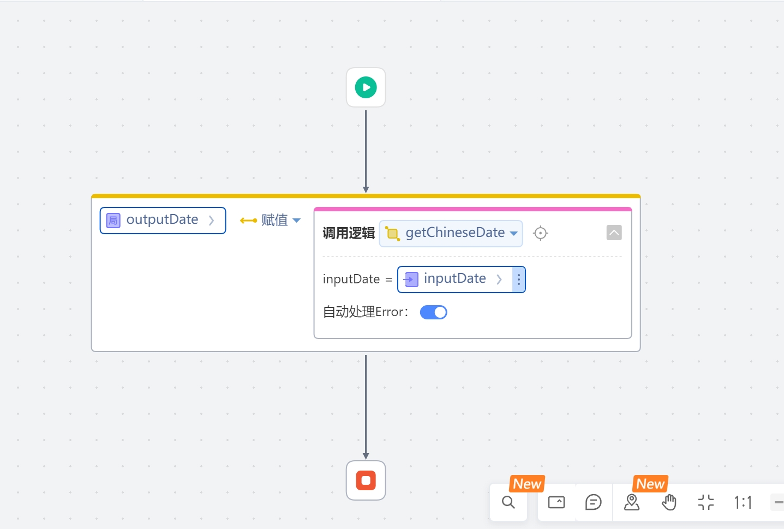

# 阴历日历依赖库
提供了一系列阴历阳历转换的方法

## 逻辑详情

### 逻辑 getChineseDate

阳历日期转农历
入参为yyyy-MM-dd格式的时间字符串，举例：2024-04-14
返回示例：二〇二四年三月初六

### 逻辑 getGregorianDate

农历日期转公历
入参：lunarYear  年（农历）,lunarMonth 月（农历），1到12，闰月为负，即闰2月=-2,lunarDay   日（农历），1到31  举例：2024,3,6
返回示例：2024-04-14

### 逻辑 getChineseMonthInfo

获取阴历月份信息
入参为yyyy-MM-dd格式的公历时间字符串，举例：2024-04-14
返回示例：三月 非闰月 小月

### 逻辑 getTerm

获取节气信息
入参为yyyy-MM-dd格式的公历时间字符串，举例：2024-04-19
返回示例：谷雨

### 逻辑 getLeapMonth

获取阴历年份的闰月信息，以及闰月的大小
入参 chineseYear 农历年份 举例：2020
返回示例：2020年闰4月,是小月

### 逻辑 getChineseZodiac

获取指定年份对应的生肖信息
入参 chineseYear 农历年份 举例：2024
返回示例：龙

### 逻辑 getFestivals

判断特定阴历日期是否为传统节日，如春节、中秋节等
入参：lunarYear  年（农历）,lunarMonth 月（农历），1到12，闰月为负，即闰2月=-2,lunarDay   日（农历），1到31  举例：2024,5,5
返回示例：端午节

### 逻辑 getDaysDifference

计算两个阴历日期之间的天数差
入参：lunarYear1  年（农历）,lunarMonth1 月（农历），1到12，闰月为负，即闰2月=-2,lunarDay1   日（农历），1到31 
      lunarYear2,lunarMonth2,lunarDay2同上 举例：2024,3,24,2024,4,2
返回示例：7

## 使用步骤说明

1.  应用引用依赖库
2.  配置应用配置参数（如果有的话）
3.  逻辑调用示例截图
4.  

## 应用演示链接

[使用了本依赖库的制品应用链接]
